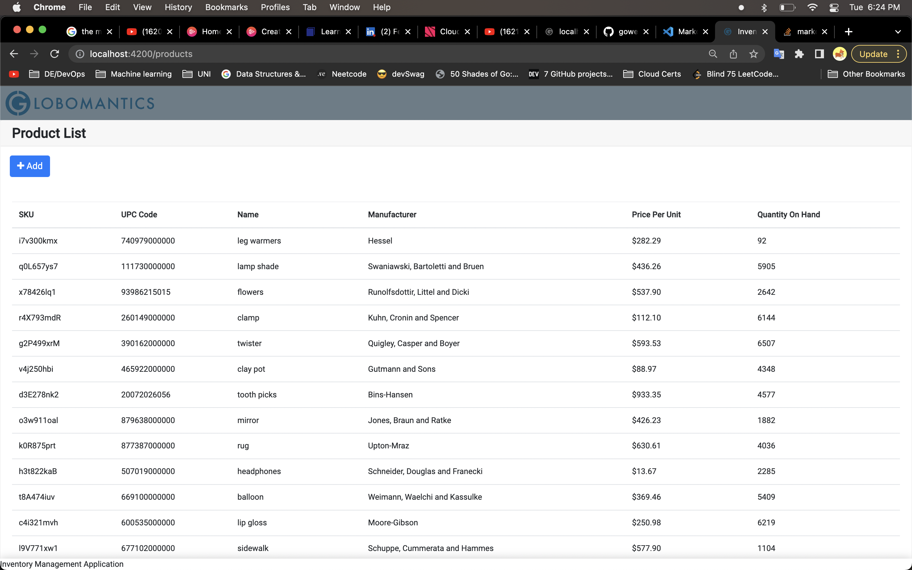
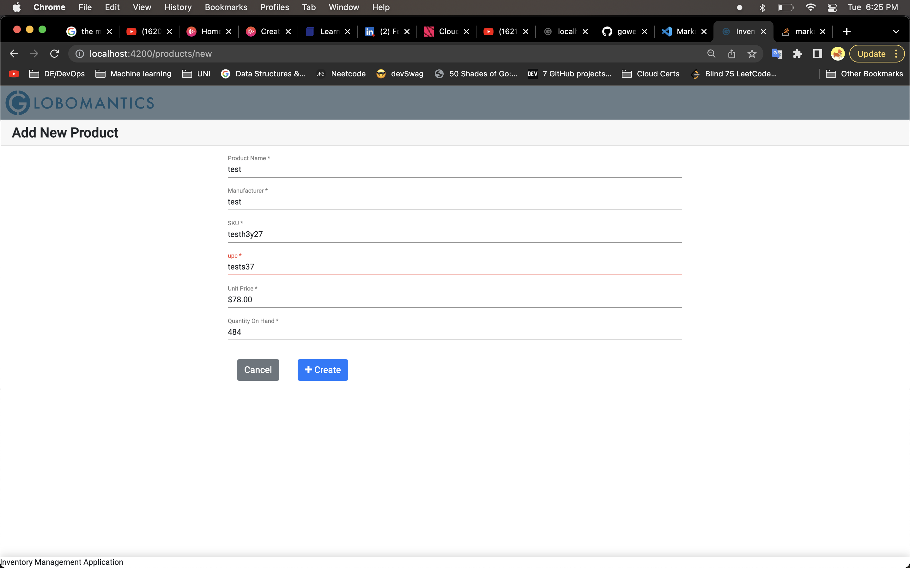
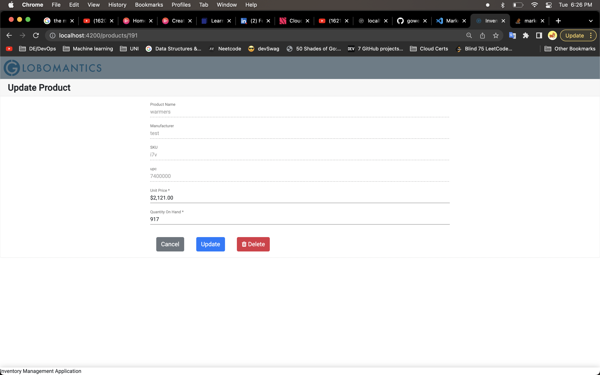
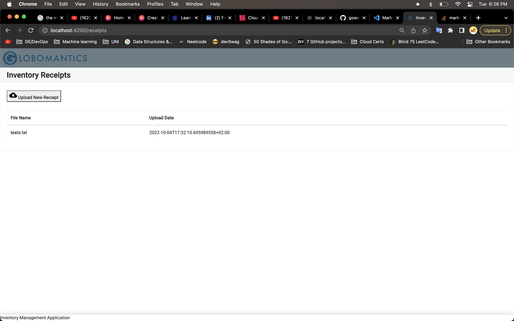

# This is a backend for Inventory Management webservice application

# Features

- Websocket for duplex communication
- Databse connectivity
- CORS https://developer.mozilla.org/en-US/docs/Web/HTTP/CORS
- Receipt upload and download

# Setup

### Frontend for this application is available in following repository

https://github.com/oovk/gowebservice-frontend

### Setup the mysql database

https://flaviocopes.com/mysql-how-to-install/

### Mysql GUI

https://dev.mysql.com/downloads/workbench/

### Use `products.sql` to populate inventory management data

### To Run

Run `go run main.go` to build the project.

### Working demo

